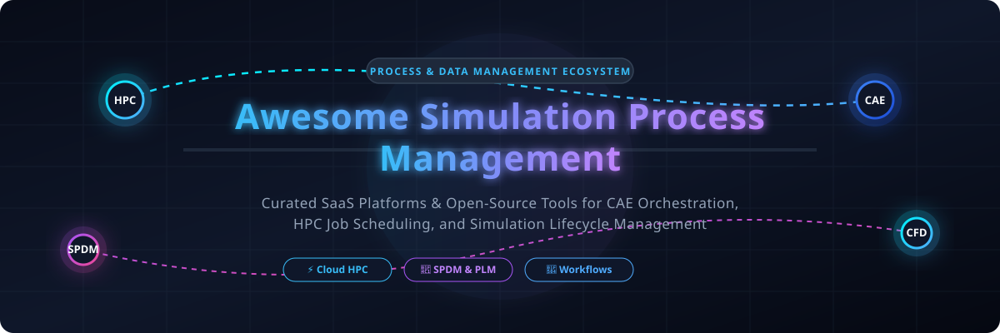

# 🚀 Awesome Simulation Process Management (SPDM)

     

> 💡 **A Curated List of Enterprise SaaS Platforms & Open-Source Tools for Simulation Process & Data Management (SPDM), Computer-Aided Engineering (CAE) Workflow Orchestration, HPC Job Scheduling, Design Exploration & Digital Twin Lifecycles.**

---

## 📌 Overview

**Simulation Process & Data Management (SPDM)** and **CAE Workflow Orchestration** enable engineering teams to automate multi-physics simulation pipelines, secure complex CAD/CAE/PLM simulation data, manage High Performance Computing (HPC) jobs, and capture full audit provenance for design space exploration and optimization.

This repository tracks the leading commercial **SaaS platforms** and high-impact **open-source projects** powering modern computer-aided engineering workflows.

---

## 📑 Table of Contents

- [☁️ SaaS / Hosted Platforms](#-saas--hosted-platforms)
- [💻 Open-Source GitHub Projects](#-open-source-github-projects)
- [💡 How to Contribute](#-how-to-contribute)
- [⚠️ Disclaimer](#%EF%B8%8F-disclaimer)
- [📈 Star History](#-star-history)

---

## ☁️ SaaS / Hosted Platforms

📊 **Market Size & Sector Insights**: The global **Simulation Process and Data Management (SPDM)** market is valued at **$4.8 Billion in 2025** and projected to reach **$11.2 Billion by 2034** (CAGR: ~9.8%). The sector is **moderately consolidated among legacy PLM leaders** (Siemens, Ansys, Dassault, Altair holding ~60% market share) while remaining **fragmented with specialized cloud-native orchestration platforms** (Rescale, SimScale, Nimbix) serving cloud-bursting workloads and open solver ecosystems.

The following SaaS platforms are sorted in **descending order by company size** (revenue or market valuation):

| Platform | Description | Pricing | Free Tier / Trial Limit | Company Size / Valuation |
| :--- | :--- | :--- | :--- | :--- |
| 🏢 **[HEEDS](https://www.siemens.com/)** | Design space exploration and optimization software (Siemens Simcenter) for automated simulation-driven design studies and process automation. | Commercial subscription starts at $10,000/year per user seat (~$1,200/month) | 30-day evaluation trial license with full solver integration upon request via Siemens partners | **~$140 Billion Market Cap** (Siemens AG; ~$4.5B Digital Software division revenue) |
| 🏢 **[Other SPDM & Simulation Platforms](https://rescale.com/)** | Enterprise solutions from major PLM/CAE vendors (Dassault 3DEXPERIENCE, Hexagon SimManager) providing simulation data management and process automation. | Commercial SPDM licenses start at $3,000–$4,500/year per user seat | 14 to 30-day sandbox evaluation trial with cloud tenant access upon vendor request | **~$45 Billion Market Cap** (Dassault Systèmes; ~$6.3B annual revenue) |
| 🏢 **[Ansys Minerva](https://www.ansys.com/products/platform/ansys-minerva)** | Enterprise Simulation Process and Data Management solution (built on Aras technology) for securing simulation data, managing workflows, and integrating with CAD/CAE/PLM tools. | Enterprise license starts at $5,000/year per user seat (or Ansys Elastic Units at $2.00/AEU) | 30-day evaluation trial with 1,000 Ansys Elastic Units (AEUs) upon partner request | **~$30 Billion Market Cap** (Ansys Inc.; ~$2.3B annual revenue) |
| 🏢 **[Altair One](https://www.altair.com/altair-one)** | Cloud platform from Altair that unifies access to simulation, HPC, and data analytics tools with process and collaboration capabilities. | Altair Units licensing starts at $50/unit per year (starter pool from $1,500/year) | 30-day free trial on Altair One Marketplace with 50 Altair Units credit; Free Student Edition available | **~$10.6 Billion Valuation** (Acquired by Siemens; ~$600M annual revenue) |
| 🚀 **[Rescale](https://rescale.com/)** | Leading cloud HPC and simulation platform that provides intelligent job orchestration, multi-solver support, and scalable infrastructure for CAE workloads. | Starts at $0.05/core-hour on-demand (or $99/month for License Hosting instance) | 5-day free trial with $10–$20 in free compute trial credits | **~$1.0 Billion+ Valuation** ($155M+ total venture funding; ~$75M+ est. ARR) |
| 🌐 **[SimScale](https://www.simscale.com/)** | Browser-based CAE platform offering CFD, FEA, and thermal simulation with collaboration features; enterprise offerings add advanced process and data management. | Starts at $1,500/year (~$125/month) for paid Professional tiers | **Community Plan**: Free forever with 3,000 core-hours/year and 10 active simulations (public projects); 14-day free trial with 500 core-hours | **~$250 Million Valuation** ($65M+ total venture funding) |
| ⚙️ **[Nimbix](https://www.nimbix.net/)** | Cloud HPC platform (part of Atos/Eviden) providing high-performance compute infrastructure, application catalogs, and workload management for engineering simulations. | Compute starts at $0.05/core-hour for CPU instances ($1.50/GPU-hour) | Developer free trial with 20 compute core-hours ($25 trial credit) upon account activation | **~$100 Million Valuation** (Sub-division of Atos; ~$11B group revenue) |
| ⚙️ **[modeFRONTIER (EnginSoft)](https://www.enginsoft.com/software/modefrontier/)** | Process integration and design optimization (PIDO) platform (ESTECO) that connects multiple CAE tools into automated, multi-disciplinary workflows. | Commercial license starts at $3,000/year per user seat (~$350/month) | 30-day free trial evaluation license with up to 100 workflow evaluation runs | **~$40 Million Valuation** (ESTECO SpA; ~$25M annual revenue) |
| ☁️ **[UberCloud](https://simr.com/)** | Cloud HPC service provider and container platform (Simr) offering managed infrastructure, application catalogs, and workload management for engineering simulations. | Starter tier starts at $2,500/year per user seat ($1.00/hour for HPC desktop instances) | 14-day free trial with up to 50 core-hours of containerized HPC simulation testing | **~$15 Million Valuation** (~$10M total funding) |
| 💻 **[TotalCAE](https://www.totalcae.com/)** | Managed HPC cloud and on-premises simulation platform providing automated web portals and job management for CAE workflows. | Managed service starts at $1,000/month (or BYOC cloud compute at $0.10/core-hour) | 30-day evaluation demo trial with 100 free core-hours of managed cloud simulation | **~$10 Million Valuation** (~$5M annual revenue) |

---

## 💻 Open-Source GitHub Projects

Full enterprise SPDM platforms with deep CAD/CAE/PLM integration are predominantly commercial. However, open-source projects excel in solvers, container-native workflow engines, HPC job schedulers, and emerging open SPDM standards.

The following repositories are sorted in **descending order by GitHub star count**:

| Repository | GitHub Stars Badge | Description | Category |
| :--- | :--- | :--- | :--- |
| ⚙️ **[Argo Workflows](https://github.com/argoproj/argo-workflows)** |  | Container-native workflow engine for orchestrating parallel simulation and data processing jobs on Kubernetes. | Workflow Orchestration |
| 💻 **[Slurm Workload Manager](https://github.com/SchedMD/slurm)** |  | Open-source fault-tolerant cluster management and HPC job scheduling system for large-scale engineering simulations. | HPC Job Scheduler |
| 🔄 **[Nextflow](https://github.com/nextflow-io/nextflow)** |  | Data-driven workflow orchestrator enabling scalable, reproducible CAE execution across cloud and on-premise HPC clusters. | Scientific Workflows |
| 🐍 **[Snakemake](https://github.com/snakemake/snakemake)** |  | Python-based workflow management system for creating reproducible and traceable simulation data processing pipelines. | Pipeline Automation |
| 🌊 **[OpenFOAM](https://github.com/OpenFOAM/OpenFOAM-dev)** |  | Premier open-source CFD toolbox with workflow automation scripts, mesh management utilities, and solver integration. | CFD Solver Ecosystem |
| 📊 **[ParaView](https://github.com/Kitware/ParaView)** |  | Open-source multi-platform data analysis and visualization tool integrated into simulation post-processing workflows. | Visualization & Post-Processing |
| 📦 **[Apptainer / Singularity](https://github.com/apptainer/apptainer)** |  | Container engine built for HPC and engineering simulation workloads requiring non-root container execution and GPU acceleration. | HPC Containerization |
| 💥 **[OpenRadioss](https://github.com/OpenRadioss/OpenRadioss)** |  | Open-source explicit structural solver for dynamic impact, crash test, and non-linear physical simulation workflows. | Explicit FEA Solver |
| 🔄 **[Cylc Flow](https://github.com/cylc/cylc-flow)** |  | Workflow engine designed for managing complex, cycling simulation suites in climate, weather, and engineering. | Suite Orchestration |
| 📂 **[openSPDM](https://github.com/openspdm/openSPDM)** |  | Open-source Simulation Process & Data Management initiative providing open schema connectors to CAE solvers and CAD/PLM systems. | Open SPDM Platform |

---

## 💡 How to Contribute

Contributions are welcome! Please follow these simple steps:

1. 🍴 **Fork** this repository.
2. 📝 **Add/edit** entries in `README.md` maintaining the table format and accurate details.
3. 🔗 **Include**: Name, official link, description, pricing, trial limits, and star counts/company size where appropriate.
4. 📬 **Submit a Pull Request** with a clear explanation of your additions.

Explore more curated awesome lists at [Awesome-Awesome-Awesome](https://github.com/ishandutta2007/Awesome-Awesome-Awesome)! ⭐

---

## ⚠️ Disclaimer

- This list is **community-curated** for informational purposes and does not imply official endorsement.
- Simulation data integrity, traceability, version control, and intellectual property protection are vital for engineering decisions.
- Open-source software requires HPC and CAE domain expertise to deploy and validate safely in production environments.

---

## 📈 Star History

---

**Made for CAE Engineers, Simulation Managers, HPC Administrators, and Digital Engineering Teams.**  
*Advancing open, reproducible, and well-managed simulation processes alongside enterprise commercial platforms.*
